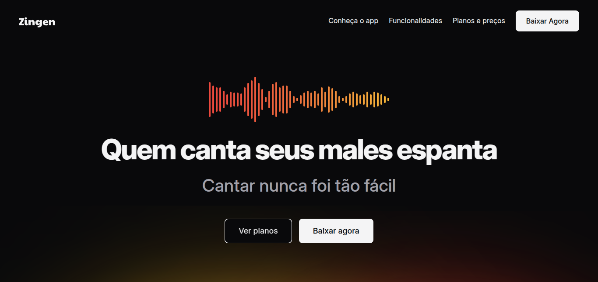

# 🎤 Zingen 🎶

> Formação Full-Stack: Avançando no HTML e CSS: Responsividade.

O projeto é uma landing page de um app de karaokê. A página destaca informações essenciais, como uma introdução ao app, suas principais funcionalidades, planos de assinatura e preços, além de oferecer opção para download.

🔗 Clique [aqui](https://fel1324.github.io/Zingen/) para acessar o projeto

## 🔥 Tecnologias

- HTML
- CSS
- Git e Github

## 💚 Contato

rafael.roberto200618@gmail.com

---

Feito com ♥ by Rocketseat :wave: [Participe da nossa comunidade!](https://discord.gg/rocketseat)